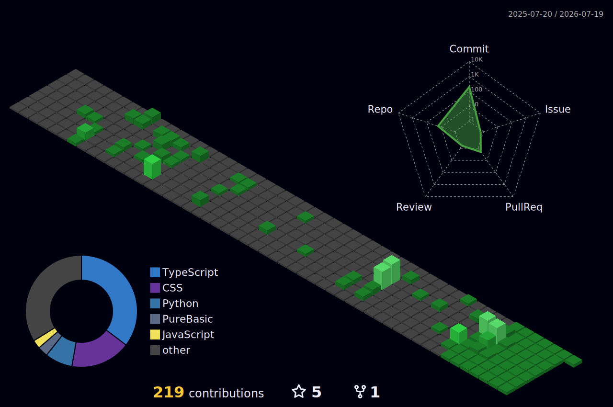

  

## 👋 Olá, eu sou Luiz Henrique!

🚀 **Desenvolvedor de Software**
📍 Marília - SP | Brasil

---

## 🧑‍💻 Sobre mim

Desenvolvedor focado na construção de aplicações web, com experiência prática no desenvolvimento de sistemas e resolução de problemas reais. Atualmente atuo como estagiário de desenvolvimento, trabalhando com manutenção de sistemas, suporte técnico e implementação de melhorias.

Além do código, sou apaixonado por ensino e comunidade. Sou co-host e co-fundador do **Codecast**, focado no lado humano dos profissionais de tecnologia. Também atuo como professor e instrutor em bootcamps de programação. Meu objetivo é sempre inspirar alunos e fortalecer o networking na comunidade tech.

---

## 🛠 Tecnologias e Ferramentas

### Frontend

### Backend

### Banco de Dados

### Infraestrutura & Ferramentas

---

## 🚀 Projetos em Destaque

### 🎙️ CodeCast - Landing Page
- Desenvolvimento de interface com React e Tailwind CSS
- Consumo de dados da API do YouTube para exibição de métricas
- Aplicação responsiva com foco em usabilidade

🔗 [Acessar Projeto](https://code-cast-two.vercel.app)
💻 [Ver Repositório](https://github.com/lorocks51987/CodeCast)

---

### 🏛️ Instituto Vozes Fortes
- Desenvolvimento de interface web moderna e responsiva
- Estruturação de conteúdo institucional
- Deploy e publicação em ambiente de produção

🔗 [Acessar Site](https://vozesfortes.com.br/)
💻 [Ver Repositório](https://github.com/lorocks51987/vozesFortes)

---

## 💼 Experiência & Conquistas

- 🛡️ **Sócio da Shield-Ack** (Conhecimento que protege)
- 🎙️ **Co-Host do CodeCast** (Explorando a trajetória de profissionais da área tech)
- 👨‍🏫 **Instrutor em Eventos de Tecnologia** (Ensino de HTML, CSS, JavaScript e Python)
- 🥈 **Bootcamp Jovem Programador (UNIMAR)** - 2º lugar

---

## 📊 Estatísticas

  

 

  

---

## 🌐 Contato

📧 lorocks57321@gmail.com
🔗 [LinkedIn](https://www.linkedin.com/in/luizhenrique51987/)

> 💡 **Disponível para projetos e trocas de conhecimento.** Vamos conversar? Entre em contato via LinkedIn ou E-mail!
